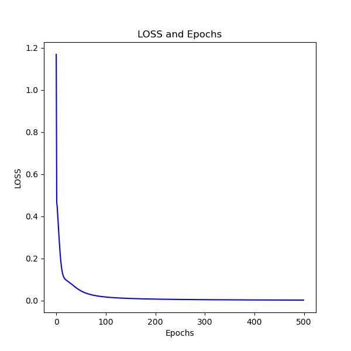
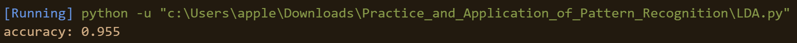
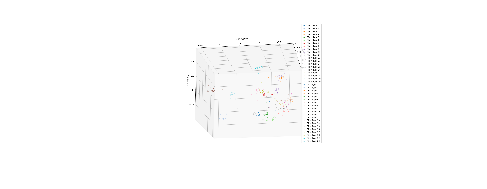
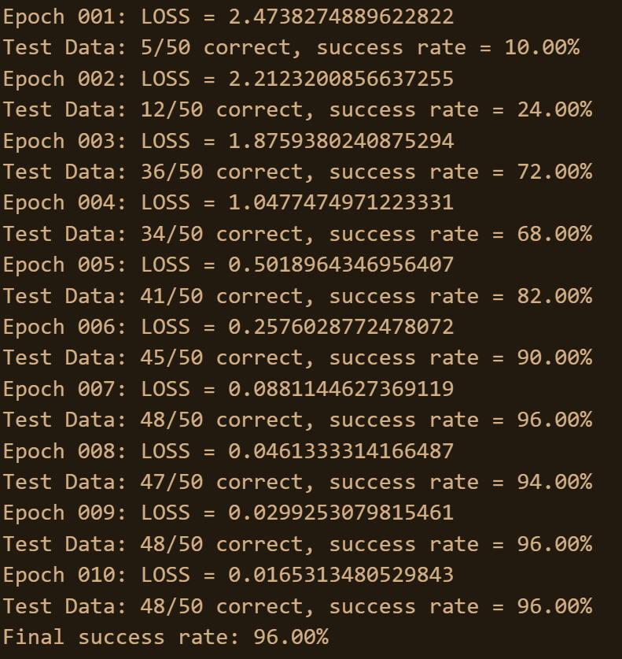
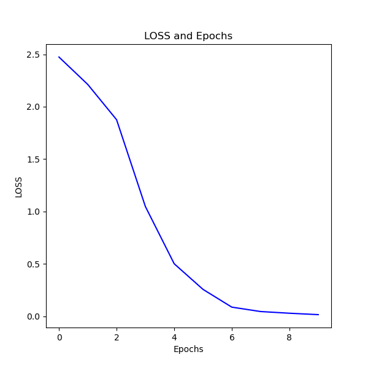

# Practice_and_Application_of_Pattern_Recognition
圖形識別實務與應用_學習成果

## 說明
* 此為圖形識別實務與應用課程中製作的各式圖形識別程序，包含倒傳遞、LDA(Linear Discriminant Analysis)、LDA 3D視覺化呈現、LMBP(Levenberg-Marquardt)
* 入口：
    * 倒傳遞：Entropy_based_BackPropagation.py
    
    * LDA：LDA.py
    
    * LDA 3D視覺化：3d_LDA.py
    
    * LMBP：LMBP_Entropy_based_BackPropagation.py
    
    
    
* 圖片位置：./ORL3232
* python版本：3.11.7
* 依賴
    * scipy：1.11.4
    * numpy：1.26.4
    * pillow：10.2.0
    * matplotlib：3.8.0
